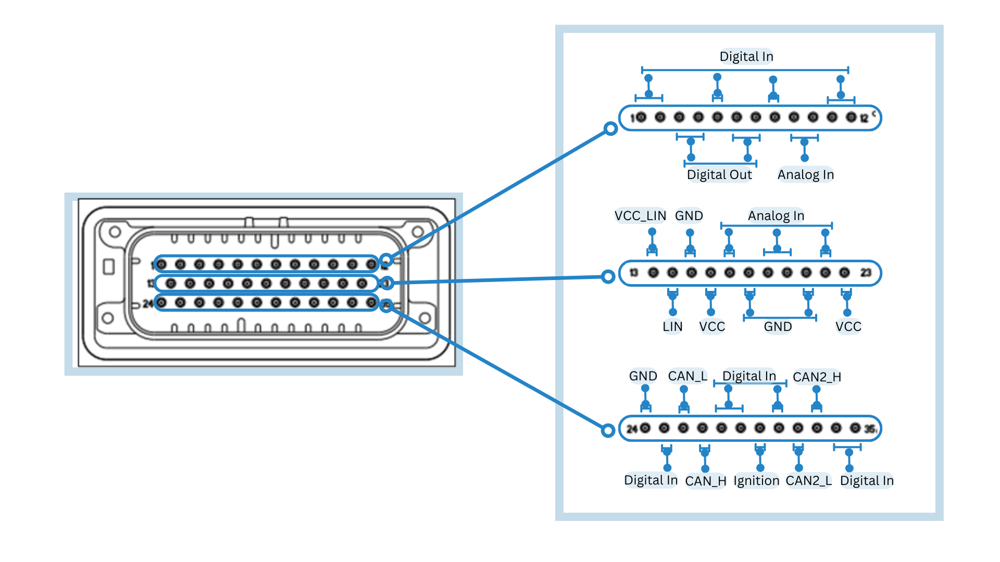
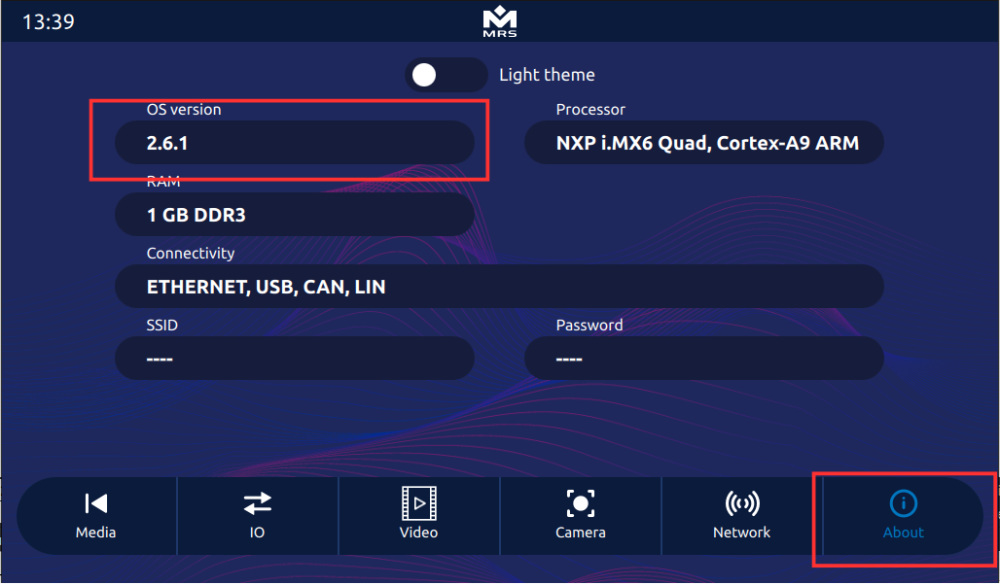

This section covers the details of some components that help you in get started with the Display.

## Connector Pins
The Display has an **AMPSEAL 776164-1** mating connector.



Each of the pins holds a specified connection that is described in the table below:

| **Pin** | **Function**       | **Pin** | **Function**       | **Pin** | **Function**             |
|---------|------------------|---------|------------------|---------|------------------------|
| **1**   | Digital In        | **13**  | VCC_LIN          | **25**  | Digital In              |
| **2**   | Digital In        | **14**  | LIN              | **26**  | CAN1_L                  |
| **3**   | Digital Out       | **15**  | GND              | **27**  | CAN1_H                  |
| **4**   | Digital Out       | **16**  | VCC              | **28**  | Digital In              |
| **5**   | Digital In        | **17**  | Analog In        | **29**  | Digital In              |
| **6**   | Digital Out       | **18**  | GND              | **30**  | Ignition (Digital In)   |
| **7**   | Digital Out       | **19**  | Analog In        | **31**  | Digital In              |
| **8**   | Digital In        | **20**  | Analog In        | **32**  | CAN2_L                  |
| **9**   | Analog In         | **21**  | GND              | **33**  | CAN2_H                  |
| **10**  | Analog In         | **22**  | Analog In        | **34**  | Digital In              |
| **11**  | Digital In        | **23**  | VCC              | **35**  | Digital In              |
| **12**  | Digital In        | **24**  | GND              |         |                        |

## Power Supply
To power up the Display, you must ensure your mating connector has the proper connections. Make the connection in the following manner:

1. Connect pins 16, 23, and 30 to +12-24V VCC (Power supply positive terminal +).
2. Connect pins 15, 18, 21, and 24 to GND (Negative terminal - ).

## Connection to Display
The display can be accessed through ssh from multiple interfaces. The available interfaces are:

- RJ45 Ethernet
- USB to Ethernet

### In built Ethernet Connection
To connect via Ethernet, simply plug the RJ45 Ethernet plug at the back of the device. By default, the display ethernet interface is configured as a DHCP server, so it will automatically assign the IP address to the connected device. You can now access the device through SSH as follows:

```
ssh root@192.168.57.1   
```

### SSH/SFTP Connection
The connection to Display via **SSH/SFTP** is required to access the terminal or perform actions like sharing files. The details of that are shown in the table below:

| **Field**                       | Value         |
|---------------------------------|---------------|
| **IP Address (Ethernet Connection)** | 192.168.57.1 |
| **Port**                         | 22            |
| **Username**                     | root          |
| **Password**                     | mrsroot       |

### USB to Ethernet Connection
To connect via USB to Ethernet, you need a **RJ45 to USB-A adapter**. Plug the USB-A end of the cable to one of the USB ports at the back of the device and the RJ45 end with RJ45 cable. The display in this configuration will be DHCP client, make sure you have DHCP server in your network and your network will be assigned to display. Find the IP address assigned to display from your network router and connect to that IP address via SSH.

## File System
By Default, the root file system is in read-only mode as it is safer and faster. However, for actions like copying the user application or enabling a ```systemd``` service, the read/write mode is required. To switch to that mode, follow these steps:

1. Type the following terminal command:
```
$ mount -o remount,rw /  
```
:::tip
```!1``` is shortcut for remounting the root file system in read/write mode
:::
2. After writing, issue the sync command to complete the process of writing to the main file and switch back to the read-only mode.
```
$ sync
$ mount -o remount,ro /
```
:::tip
```!2``` is shortcut for remounting the root file system in read-only mode
:::

## Read/Write Partition
The root file system operates in read-only mode. However, there is a dedicated partition for user data and operates in read/write mode. This partition also contains some important configuration files that you can change and is 1.2GB in size.

To navigate to this location, enter the following commands:
```
$ cd /rw_data
```
:::note
After writing files to the read/write partition, ensure to issue the **sync** command to complete the process of writing to the partition.
:::

## Operating System
This section covers the steps of finding the current version of the Display’s Operating System (OS) and updating it.

### Current Version
Enter the following commands in the terminal to find the current version of the OS:
```
$ get-os-version
$ System version:  2.6.1	
```
To access the information about OS version in the Reference App, navigate to the About tab as shown below:



## Screen Setup
This section covers the details of setting up your screen such as touch screen calibration and backlight control.

### Touch Screen Calibration (if required, By default already calibrated at factory)
To calibrate the touch screen, run the ```ts_calibrate``` utility from the terminal as shown below:
```
$ mount -o remount,rw /
$ ts_calibrate
$ mount -o remount,ro /
```
Once done, the calibration utility shows on the display and prompts you to touch the crosshair on the touch screen. When all the touch points are satisfied, the utility terminates and saves the calibration file.

### Backlight Control
The brightness of the backlight can be controlled programmatically or from the terminal. The backlight has 100 steps of brightness (0-100), with 0 being the lowest and 100 being the highest.
To control the backlight from the terminal, use the following command:
```
$ echo 100 > /sys/class/backlight/backlight/brightness
```
To control the backlight in the **Reference App** via C++, add the following to the code:
```
io->set_backlight(100);	// Set backlight to 100%
io->set_backlight(50);	// Set backlight to 50%
```
To control the backlight of the device from the Reference App, use the slider bar in the left as shown below:
