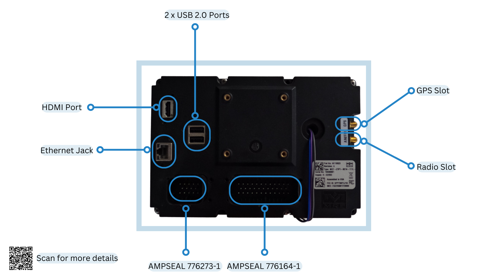
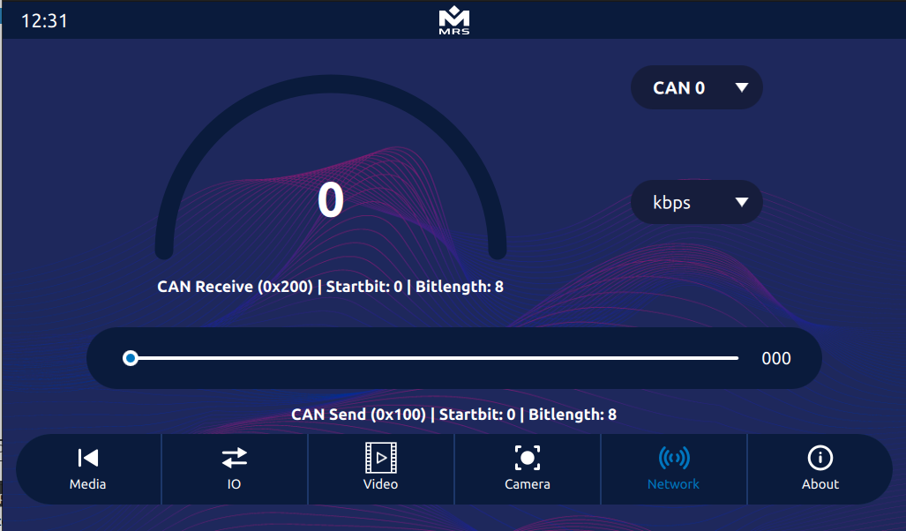
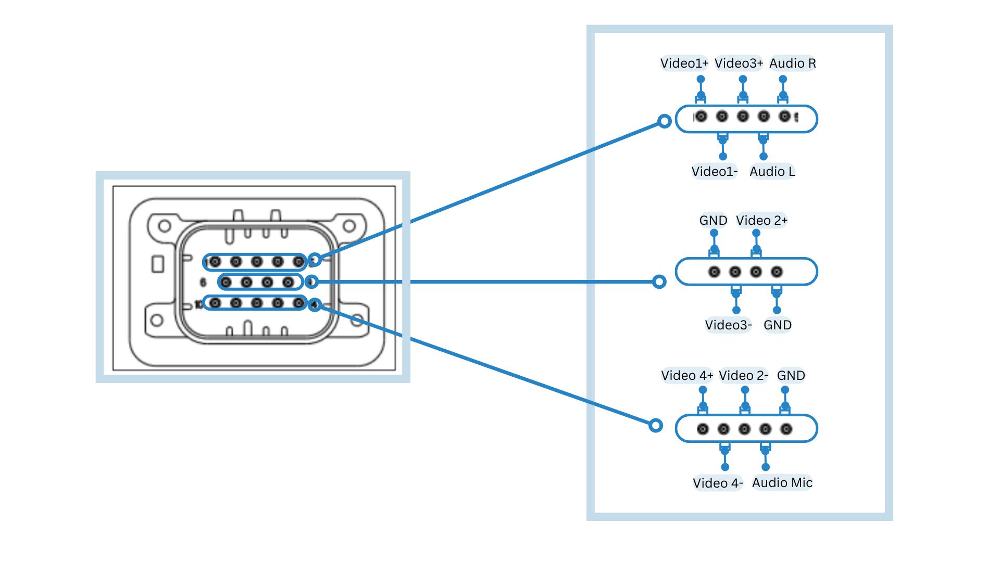
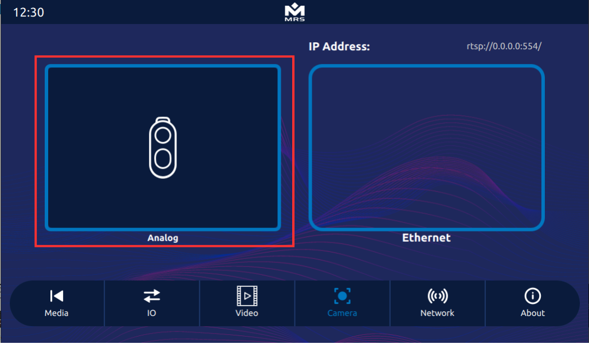
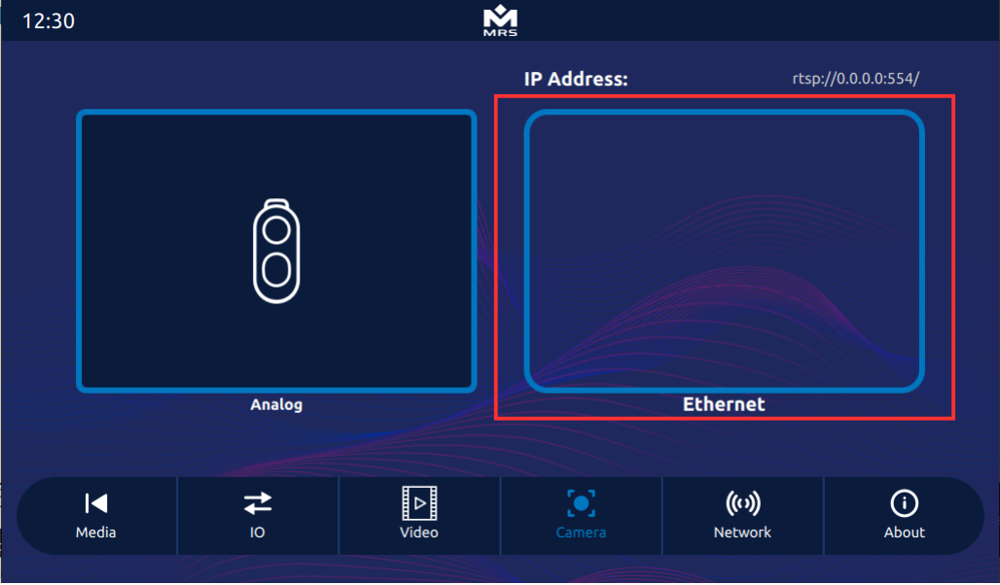

# Peripheral Interfaces
The MConn Display has several peripheral interfaces that allow the connection to various devices and components. This section covers the details of all those interfaces.

Following diagram shows all the peripheral interfaces of MConn Display (full configuration):



## SD Card
:::note
Optional
:::
The Display holds an SD card slot that is an additional space to store user data. If the SD card is pre-installed, the system mounts the SD card automatically. The steps to write files on the SD card are as follows:

1. Find the SD card at the following address:
```
$ ls /
$ sdcard
```
2. Enable the read/write mode. This have been covered in the [File System](../../getting-started/setting-up-mconn#file-system) section.
3. Write the files to the SD card as per the requirement.
4. Enter the sync command to complete the writing process.

## USB
The Display comes with two **USB 2.0** host ports that interface various devices, such as Flash drives, USB-to ethernet, USB wifi BT adapters, etc. When the USB connects, the system mounts the USB storage automatically. The steps to write files on USB storage are as follows:

1. Find the USB storage at the following address:
```
$ ls /run/media/
$ sda1
```
2. Enable the read/write mode. This have been covered in the [File System](../../getting-started/setting-up-mconn#file-system) section.
3. Write the files to the USB storage as per the requirement.
4. Enter the sync command to complete the writing process.

## CAN
The Display has two CAN bus interfaces. By default, the baud rate of both CAN bus interfaces is configured at 250Kbit/s. The baud rate settings for CAN bus interfaces are as follows:

- The baud rate of the CAN-0 bus interface **cannot** be updated directly as the co-processor is also connected to this bus, So to update the baud rate, first make sure you update the baud rate of the coprocessor. (Use Applics studio to update or contact MRS Electronic for further information).
- The CAN-1 bus interface can be updated directly to the baud rates of up to 1Mbit/s.
To change the baud rate of can0 interfaces, follow the steps below:

Enter the following terminal commands:
```
$ ifconfig can0 down
$ ip link set can0 type can bitrate <your-baudrate> triple-sampling on restart-ms 500
$ ifconfig can0 up
```
Terminal commands' changes will be lost after reboot. For permanent changes, update the files in the ```/etc/systemd/network``` directory.

A code example of interaction with the CAN bus in C++ can be found in the can.cpp class of the **Reference App**. This class sends and receives data from both CAN bus interfaces using the **SocketCAN API**. Navigate to the kernel documentation to find more information about it.
:::note
Besides the SocketCAN API, a **Qt Serial Bus API** implements the CAN Bus functionality. The Reference App does not use this method, but you can find more information about it at this [link](https://doc.qt.io/qt-5/qtcanbus-backends.html).
:::
To access the CAN output in the **Reference App**, navigate to the **Network** tab:



## Ethernet
The Display has one **Gigabit Ethernet** interface that allows connection to the LAN network. The Ethernet interface can be configured in either DHCP client or DHCP server mode. By default, it's configured as a DHCP server with IP 192.168.57.1.

To configure the ethernet, use the following terminal commands:
```
// For help and possible modes
$ eth-conf.sh -h
// configuring as DHCP server
$ eth-conf.sh -s
// configuring as DHCP client
$ eth-conf.sh -c
```

## Camera
This section covers the details of the camera interfaces on the Display.

### Analog Camera
The display has four analog camera inputs that can be viewed all together, making it feasible to use for multiple views at once. The streams can be recorded, and the video can be saved to the disk.

It is important to ensure that the correct video pin is connected to the mating connector **AMPSEAL 776273-1** before executing any command.



The table below maps out the pins for the cameras connection:

| **Pin** | **Function** | **Pin** | **Function** |
|---------|--------------|---------|--------------|
| 1       | Video1+      | 8       | Video2+      |
| 2       | Video1-      | 10      | Video4+      |
| 3       | Video3+      | 11      | Video4-      |
| 7       | Video3-      | 12      | Video2-      |

To show the live view of cameras on the screen, use the following commands:
```
$ gst-launch-1.0 imxv4l2videosrc device=/dev/video0 ! imxg2dvideosink window-width=512 window-height=300 window-x-coord=0 window-y-coord=0 & > /dev/null 2>&1 &
$ gst-launch-1.0 imxv4l2videosrc device=/dev/video1 ! imxg2dvideosink window-width=512 window-height=300 window-x-coord=512 window-y-coord=0 & > /dev/null 2>&1 &
$ gst-launch-1.0 imxv4l2videosrc device=/dev/video2 ! imxg2dvideosink window-width=512 window-height=300 window-x-coord=0 window-y-coord=300 & > /dev/null 2>&1 &
$ gst-launch-1.0 imxv4l2videosrc device=/dev/video3 ! imxg2dvideosink window-width=512 window-height=300 window-x-coord=512 window-y-coord=300 & > /dev/null 2>&1 &
```
To access the analog camera in the **Reference App**, navigate to the **Analog** view in the **Camera** tab:



### Ethernet Camera
The display supports an ethernet camera with H.264 video compression. To view the video stream, use the **GStreamer** pipeline. However, before launching the pipeline, ensure the camera sends the UDP/RTP stream and that it is connected to the Display. For detailed information and C++ implementation, refer to the CameraItem module of the **Reference App**.

To view the video stream via **GStreamer** pipeline, use the following commands:
```
$ gst-launch-1.0 -v udpsrc port=5014 caps="application/x-rtp, media=(string)video, encoding-name=(string)H264 , payload=(int)96" ! rtpjitterbuffer ! rtph264depay ! h264parse ! imxvpudec ! videoconvert ! imxg2dvideosink
```
:::note
Some camera models use different protocols, so you have to adapt the pipeline accordingly.
:::

To access the ethernet camera in the **Reference App**, navigate to **Ethernet** view in the **Camera** tab:



## Audio
The display has a stereo audio output and a microphone input. For information on how to use these functions, consult the ALSA documentation.

The table below defines the pins for audio input and output on the mating connector **AMPSEAL 776273-1**:

| **Pin** | **Function** |
|---------|--------------|
| 4       | Audio L      |
| 13      | Audio Mic    |
| 5       | Audio R      |

There are several ways to play an audio file on the Display, but the simplest method is to play a .wav file using **aplay** (available in the **ALSA** utility library).

Use the following commands to play a .wav file from the terminal:
```
$ aplay test.wav
```
To make a ten second recording, use the following terminal command:
```
$ arecord -d 10 /tmp/test-mic.wav
```