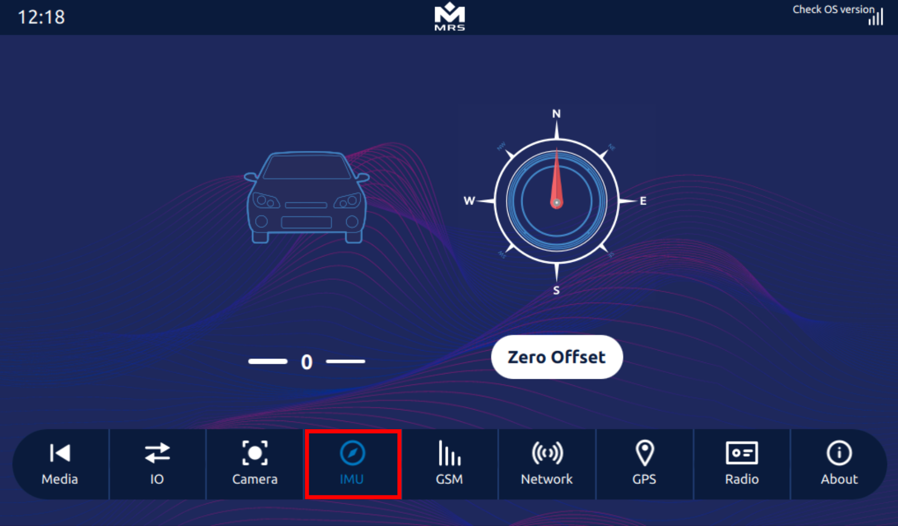

# Sensors
The Display has several sensors that can be interfaced with your software application.

## IMU – Accelerometer 
:::note
Optional: Not available as standard option
:::
The **LSM9DS1** IMU is embedded on the Display’s PCB. It is a 9DOF chip and comes with the following:

- 3D digital linear acceleration sensors
- 3D digital angular rate sensors
- 3D digital magnetometer sensors

It uses the **I2C-1** serial bus interface to communicate with the Display processor. In Qt application, the **RTIMULib** is used to communicate with the device. The library requires a settings file to run properly. This file includes general IMU settings and those related to the IMU chip (**LSM9DS1**) in use.

The library contains a calibration document with calibration values, which can be used to remove IMU soft and hard iron disturbances.

The C++ implementation of **RTIMULib** in the **Reference App** is as follows:
```
RTIMUSettings *settings = new RTIMUSettings("RTIMULib");
RTIMU *imu = RTIMU::createIMU(settings);
imu->IMUInit();
imu->setSleepPower(0.02);
imu->setGyroEnable(true);
imu->setAccelEnable(true);
imu->setCompassEnable(true);
while (imu->IMURead()) 
{
  RTIMU_DATA imuData = imu->getIMUData();
}
```
To find the output of the IMU Sensor in the **Reference App**, navigate to the **IMU** tab:



## Real-Time Cock (RTC)
The Display has an integrated hardware RTC. The RTC keeps track of the current time when the display is not powered on and re-syncs with the Linux OS when the Display is powered on.

To set up the RTC, enter the following commands in the terminal:
```
$ date -s "2021-07-22 17:00:00"
$ hwclock -w 
```