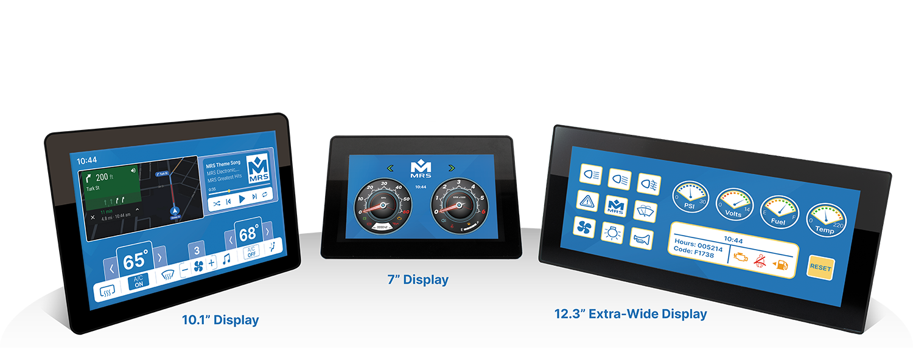

# General Information
This chapter includes information related to the product and its usage.

## Product Details

### Product Names
1. MConn 7"
2. MConn 10.1"
3. MConn 12.3"

### Introduction
The MConn7, MConn10, and MConn 12.3 are MRS Electronic's new generation of Connected Displays. They come with a powerful 32-bit multi-core ARM Cortex-A9 processor, 2D, 3D, and Vector Graphics hardware acceleration. Featuring a multi-touch PCAP touchscreen, operators can take advantage of many gestures found on tablets today, including pinch-to-zoom, rotation, flick, and more.

**[To Do] Add block diagram of features available in MConn variants**

### Product Variants
1. Single Basic
2. Quad Basic
3. Quad Audio Video
4. Quad All-in-One

### Screen Sizes
The display is available in three standard screen sizes: *7", 10.1", and 12.3"*. Depending on the project volume, customization in other sizes is also possible.

### Processor and Performance
The Standard MConn displays are equipped with powerful iMX6 processor, custom displays with other processors are possible depending on the project volume.

### Technical Data

- Housing PC-ABS
- Connector
  - 1: TE AMPSEAL 35pol.
  - 2: TE AMPSEAL 14pol. (for Audio Video and All-in-One variants)
  - 3: RJ45 for Gigabit Ethernet
  - 4: 2x USB-A
- Colour TFT Display
  - 7" (1024 x 600, 800 cd/m²)
  - 10.1" (1280x800, 800 cd/m²)
  - 12.3" (1920x720, 800 cd/m²)
- Temperature range (acc. to ISO 16750-4)
  - Operation -20°C to 70°C
  - Storage -30°C to 80°C
- Environmental protection (acc. to IEC 60529)
  - IP 54
  - IP 65
- Current consumption: ~260 mA @ 24 V / ~460 mA @ 12 V
- Total inputs and outputs 22:
  - 12 Digital inputs (2 frequency inputs capable)
  - 6 Analog inputs (0 - 12.5V)
  - 4 Digital outputs (High Side, 2A each)
- 1x Buzzer
- Multitouch PCAP touchscreen (configurable)
- Dimmable backlight
- Analog Camera 4x in parallel
- Digital Ethernet Camera - Multiple (depends upon resolutions)
- Operating voltage 9 - 32V (Code B at 12 V, Code E at 24 V acc. to ISO 16750-2)
- 11.6 - 32V for 10 V Reference voltage output
- Overvoltage protection ≥ 33 V
- Reverse polarity protection
- CAN Interfaces 2x ISO 11898-2:2016 capable CAN Transceiver
- E1 approval 06 9864
- Electrical tests
  - Acc. to ISO 16750 – 2 resp. -4: Short circuit protection Reverse polarity test Ground offset Disconnection of pins and connector Long-term overvoltage at TMax-20K Storage test at TMax and TMin Operation test at TMax and TMin Starting profile (form. Pulse 4 acc. to ISO 7637) Superimposed alternating voltage Slow decrease and increase of supply voltage Momentary drop in supply voltage Reset behaviour at voltage drop
  - Acc. to ISO 7637 - 2: Pulse 1, 2a, 2b, 3a, 3b
  - Acc. to ISO 10605: Display ESD-resistant up to 15 kV all other ESD-resistant up to 4 kV

### Operating System and Software Compatibility
The display operates on **Yocto OS kernel version 4.19.35** and is compatible with **Qt 5.12.9**, providing a stable and versatile platform for various applications.

MConn is an ideal choice for professionals in automotive, agriculture machines, special vehicles, and industries.

## Reference App
To facilitate the developer, MRS Electronic developed a Reference Application written in Qt/QML. This application shows how to use different MConn interfaces for custom applications.

This document refers to the Reference App to better understand the system's components, interactions, and customization abilities.

## Intended Users
These instructions address trained experts familiar with the software's programming and technical understanding. Due to their expert training, knowledge, experience, and knowledge of the relevant standards and regulations, trained experts can assess the tasks assigned to them and recognize possible dangers.

## Document Conventions
This document contains prompt boxes for users to consider before making certain calls to action. The measures for averting risks described in the instructions must be implemented to avoid the risk of property damage or personal injury.

:::tip
A notice of this sort denotes an important prerequisite to completing the process.
:::

:::note
A notice of this sort denotes an additional piece of information that can be helpful for the user.
:::

:::danger
A notice of this sort denotes a danger that may arise.
:::

:::caution
A notice of this sort denotes a warning message.
:::

## Validity
These instructions become valid when the product is transferred from MRS Electronic to the customer. Changes to these operating instructions are possible at any time and without the specification of any reason. The current version of this document replaces all previous versions of user manuals ever released.

## Copyright Information
This manual, in its entirety, is copyrighted to © MRS Electronic, Inc. and protected by international copyright laws. All rights are reserved. No part of this manual may be reproduced in any form without the written permission of MRS Electronic, Inc. All trademarks are the property of their respective owners.

MRS Electronic, Inc. has compiled this document with the utmost diligence while keeping the current state of technology in mind. However, MRS Electronic, Inc. will not assume any liability or responsibility for any errors in content, form, or missing updates that result in damages or drawbacks.

## Technical Support
This section provides you information related to technical support from the manufacturer.

|                |                |
| -------------- | -------------- |
| **Manufacturer Name**  | MRS Electronic, Inc.  |
| **Address**  | 6680 Poe Ave, Suite 100, Dayton, OH 45414  |
| **Telephone**  | +1 937 522 0800  |
| **Website**  | https://www.mrs-electronics.com  |
| **Email** | info@mrs-electronics.com |

## Warranty Conditions
See the [Terms and Conditions of Sale - North America](https://www.mrs-electronics.com/fileadmin_us/products/files/MRS_Electronic_Terms_and_Conditions_V82024.pdf) of MRS Electronic, Inc.